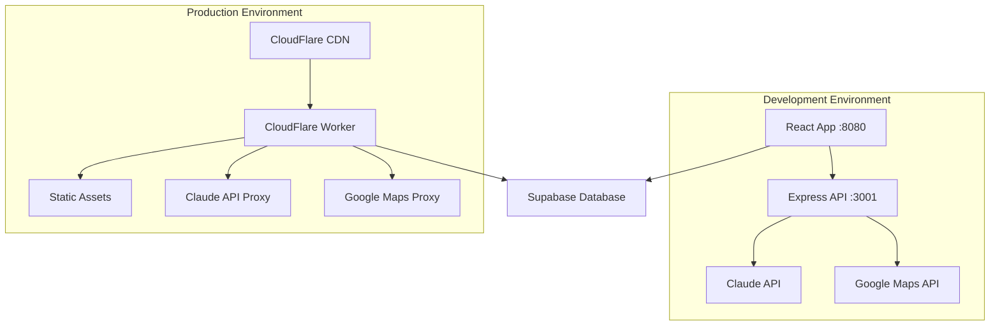

# Development Guide: Wandering Paths Restaurant Curation System

## System Overview

Wandering Paths is a sophisticated restaurant curation and discovery application built with modern web technologies. The system uses CloudFlare Workers for production deployment with AI-powered restaurant extraction, multi-location support, and advanced geo-search capabilities.

**Live Application**: [restaurants.hultberg.org](https://restaurants.hultberg.org)

## Architecture Summary

### Tech Stack
- **Frontend**: Vite + React 18 + TypeScript (strict mode)
- **UI Framework**: shadcn/ui with Radix UI components
- **Styling**: Tailwind CSS with custom earth-tone design system
- **State Management**: TanStack Query v5 for server state
- **Database**: Supabase PostgreSQL with multi-location schema
- **Authentication**: Supabase Auth with magic links
- **AI Integration**: Claude 3.5 Sonnet API for extraction and review summarization
- **Maps**: Mapbox GL JS v3.14.0 with clustering support
- **Geo Services**: Google Maps Geocoding and Places APIs
- **Deployment**: CloudFlare Workers with static asset serving

### Development vs Production Architecture



## Prerequisites

- Node.js 18+ (recommended: use [nvm](https://github.com/nvm-sh/nvm))
- npm or yarn package manager
- **Required API Keys:**
  - Supabase project (database + auth)
  - Claude API key (Anthropic)
  - Google Maps API key (Geocoding + Places)
  - Mapbox access token (for maps)

## Environment Setup

### 1. Clone and Install
```bash
git clone <repository-url>
cd wandering-paths-record
npm install
```

### 2. Environment Configuration

Create `.env` file in project root:
```env
# Supabase Configuration
VITE_SUPABASE_URL=https://your-project.supabase.co
VITE_SUPABASE_ANON_KEY=your_supabase_anon_key

# Authentication
VITE_AUTHORIZED_ADMIN_EMAIL=your@email.com

# AI & Maps (Development)
VITE_CLAUDE_API_KEY=your_claude_api_key
VITE_GOOGLE_MAPS_API_KEY=your_google_maps_key
VITE_MAPBOX_ACCESS_TOKEN=your_mapbox_token

# Development API URL
VITE_API_BASE_URL=http://localhost:3001
```

**Production Secrets** (CloudFlare Workers):
```toml
# wrangler.toml (already configured)
[vars]
SUPABASE_URL = "https://drtjfbvudzacixvqkzav.supabase.co"
AUTHORIZED_ADMIN_EMAIL = "magnus.hultberg@gmail.com"

# Set via: wrangler secret put <KEY>
CLAUDE_API_KEY=<secret>
GOOGLE_MAPS_API_KEY=<secret>
```

### 3. Database Setup

The application uses a sophisticated multi-location restaurant schema:

```sql
-- Core restaurant data
CREATE TABLE restaurants (
    id UUID PRIMARY KEY,
    name TEXT NOT NULL,
    address TEXT, -- Human-readable summary
    website TEXT,
    status TEXT CHECK (status IN ('to-visit', 'visited')),

    -- Ratings & Reviews
    public_rating DECIMAL(2,1),
    public_rating_count INTEGER,
    personal_rating DECIMAL(2,1),
    public_review_summary TEXT,
    public_review_summary_updated_at TIMESTAMP,

    -- Restaurant Details
    cuisine TEXT,
    price_range TEXT,
    atmosphere TEXT,
    description TEXT,
    must_try_dishes TEXT[],
    dietary_options TEXT,

    -- Metadata
    source TEXT DEFAULT 'manual',
    source_url TEXT,
    created_at TIMESTAMP DEFAULT NOW(),
    updated_at TIMESTAMP DEFAULT NOW()
);

-- Multi-location support for restaurant chains
CREATE TABLE restaurant_addresses (
    id UUID PRIMARY KEY,
    restaurant_id UUID REFERENCES restaurants(id) ON DELETE CASCADE,
    location_name TEXT, -- e.g., "Shoreditch", "King's Cross"
    full_address TEXT,
    city TEXT,
    country TEXT,
    latitude DECIMAL(10, 8),
    longitude DECIMAL(11, 8),
    phone TEXT,
    created_at TIMESTAMP DEFAULT NOW()
);
```

## Development Workflow

### 1. Start Development Environment
```bash
# Terminal 1: Start React development server
npm run dev
# Serves on http://localhost:8080

# Terminal 2: Start API server (for AI extraction)
npm run api
# Serves on http://localhost:3001
```

### 2. Access the Application
- **Frontend**: http://localhost:8080
- **Admin Panel**: Sign in with your configured email
- **API Health**: http://localhost:3001/health

### 3. Key Development Features

#### Admin Panel (`/admin`)
- AI-powered restaurant extraction from URLs
- Batch geocoding and review enrichment
- Individual restaurant operations (geocoding & review updates)
- Cache management for development
- Manual restaurant entry and editing

#### About Page (`/about`)
- Comprehensive explanation of the appreciation system
- Feature overview and tech stack information
- Personal branding and curation philosophy
- User guide for behavioral rating scale

#### Restaurant Details (`/restaurant/:id`)
- Comprehensive restaurant information display
- Multi-location support with individual location cards
- Smart layout: Description spans full width when Source is empty
- Interactive maps integration
- Personal appreciation badges with tooltips
- Admin controls for authenticated users

#### Interactive Features
- Multi-location restaurant search
- GPS-based "Near Me" functionality
- Interactive Mapbox maps with clustering
- Advanced filtering (cuisine, status, location)
- SPA routing with deep linking support

## Core System Components

### 1. AI Restaurant Extraction

**Location**: `src/services/claudeExtractor.ts`

```typescript
// Intelligent business detection + restaurant data extraction
const extractionFlow = {
    1: "Business Type Detection", // Restaurant vs. hotel/gallery/retail
    2: "Content Analysis", // Multi-page crawling via proxy
    3: "Data Extraction", // Structured restaurant information
    4: "Multi-Location Processing" // Chain restaurant handling
};
```

**Features**:
- Smart business type detection (avoids extracting non-restaurants)
- Multi-page content analysis with proxy services
- Automatic multi-location detection and geocoding
- 24-hour URL caching to prevent duplicate API calls
- Cost optimization (~$0.01-0.05 per extraction)

### 2. Multi-Location Architecture

**Location**: `src/services/restaurants.ts`

The system supports both single-location restaurants and multi-location chains:

```typescript
interface Restaurant {
    // Core restaurant data
    name: string;
    address: string; // Human-readable summary

    // Multi-location support
    locations?: RestaurantAddress[];
}

interface RestaurantAddress {
    location_name: string; // "Shoreditch", "King's Cross"
    full_address: string;
    latitude?: number;
    longitude?: number;
    city: string;
    country: string;
}
```

**Search Capabilities**:
- Find restaurants by location name ("Dishoom Shoreditch")
- GPS-based distance calculations
- Multi-city restaurant chain support

### 3. Review Enrichment System

**Location**: `src/services/reviewEnrichmentService.ts`

**Phase 2 Feature**: Automatic enhancement with Google Reviews data

```typescript
const enrichmentProcess = {
    1: "Google Places Search", // Find restaurant on Google Maps
    2: "Reviews Retrieval", // Fetch recent reviews and ratings
    3: "Claude Summarization", // AI-generated review summary
    4: "Must-Try Dishes", // Extract popular menu items
    5: "Database Update" // Store enriched data
};
```

### 4. Smart Geo Search

**Location**: `src/services/smartGeoSearch.ts`

**Phase 3 Feature**: Advanced location-based search

```typescript
// GPS-based "Near Me" functionality
const geoSearch = {
    userLocation: "GPS coordinates via browser",
    haversineDistance: "Calculate distances to restaurants",
    locationBias: "Improve geocoding accuracy",
    proximitySort: "Order results by distance"
};
```

### 5. Interactive Maps

**Location**: `src/components/InteractiveMap.tsx`

**Features**:
- Mapbox GL JS integration with custom earth-tone styling
- Restaurant clustering for performance
- Popup navigation to restaurant details
- Mobile-optimized controls
- Real-time filter synchronization

## API Architecture

### Development APIs (Express Server)

**Base URL**: `http://localhost:3001`

```typescript
// AI Extraction
POST /api/extract-restaurant
Body: { url: string }
Response: { success: boolean, data: RestaurantData }

// Health Check
GET /health
Response: { status: "OK", timestamp: string }
```

### Production APIs (CloudFlare Workers)

**Base URL**: `https://restaurants.hultberg.org`

```typescript
// Restaurant Extraction (with CORS handling)
POST /api/extract-restaurant
Headers: { "Content-Type": "application/json" }

// Claude API Proxy (for review summarization)
POST /api/claude
Body: Claude API request format

// Google Maps Proxy (geocoding, places, reviews)
GET /api/google-maps?endpoint=geocode&query=address
GET /api/google-maps?endpoint=textsearch&query=restaurant
GET /api/google-maps?endpoint=details&place_id=xyz
```

## Deployment

### Development Build
```bash
npm run build:dev  # Development mode build
npm run preview    # Preview production build locally
```

### Production Deployment
```bash
# Deploy to CloudFlare Workers
npx wrangler deploy

# Production URLs:
# - https://restaurants.hultberg.org (custom domain)
# - https://wandering-paths-record.herrings.workers.dev (workers.dev)
```

### CloudFlare Workers Configuration

**File**: `wrangler.toml`
```toml
name = "wandering-paths-record"
compatibility_date = "2025-01-01"
compatibility_flags = ["nodejs_compat"]
main = "./src/worker.js"

# Static assets served from dist/client
[assets]
directory = "./dist/client"

# Custom domain routing
[[routes]]
pattern = "restaurants.hultberg.org/"
zone_name = "hultberg.org"

[[routes]]
pattern = "restaurants.hultberg.org/*"
zone_name = "hultberg.org"

# Environment variables (non-sensitive)
[vars]
SUPABASE_URL = "https://drtjfbvudzacixvqkzav.supabase.co"
AUTHORIZED_ADMIN_EMAIL = "magnus.hultberg@gmail.com"
```

## Testing & Quality Assurance

### Testing Restaurant Extraction
1. **Navigate to Admin Panel**: Sign in with configured email
2. **Test Restaurant URLs**:
   - Fine dining: `https://noma.dk`
   - Chain restaurants: `https://dishoom.com`
   - Multi-location: `https://hawksmoor.com`
3. **Test Non-Restaurant Detection**:
   - Art gallery: `https://tate.org.uk`
   - Retail: `https://apple.com`

### Development Testing
```bash
# Run linter
npm run lint

# Type checking
npm run type-check

# Build verification
npm run build
```

### Monitoring & Debugging

**Browser Console Debugging**:
```javascript
// Enable extraction debugging
localStorage.setItem('debug-extraction', 'true');

// Monitor API calls
localStorage.setItem('debug-api', 'true');
```

**CloudFlare Workers Monitoring**:
```bash
# Real-time log monitoring
npx wrangler tail

# Check deployment status
npx wrangler deploy --dry-run
```

## Common Development Issues

### 1. API Key Configuration
```bash
# ❌ "Claude API key not configured"
# ✅ Ensure VITE_CLAUDE_API_KEY is set in .env
# ✅ Restart both dev servers after env changes

# ❌ "Google Maps error"
# ✅ Verify VITE_GOOGLE_MAPS_API_KEY is valid
# ✅ Check API quotas and billing in Google Cloud Console
```

### 2. CORS Issues
```bash
# ❌ Development CORS errors are expected
# ✅ Content fetching uses proxy services to bypass CORS
# ✅ Production uses CloudFlare Workers (no CORS issues)
```

### 3. Database Connection
```bash
# ❌ Supabase connection failed
# ✅ Verify VITE_SUPABASE_URL and VITE_SUPABASE_ANON_KEY
# ✅ Check Supabase project status and RLS policies
```

### 4. Maps Not Loading
```bash
# ❌ Mapbox maps not displaying
# ✅ Verify VITE_MAPBOX_ACCESS_TOKEN is set
# ✅ Check Mapbox account limits and usage
```

### 5. SPA Routing Issues
```bash
# ❌ 522 errors on restaurant detail page refresh (production)
# ✅ This is resolved - worker handles SPA routing with embedded HTML

# ❌ Localhost development SPA routing issues
# ✅ Known issue - production works perfectly, use production for testing deep links
# ✅ For development, navigate via the app rather than direct URL refresh
```

### 6. CloudFlare Workers Deployment
```bash
# ❌ ASSETS binding not available
# ✅ This is resolved - worker uses environment-aware routing
# ✅ Development: passes through to Vite
# ✅ Production: serves embedded HTML for SPA routes

# ❌ Worker version not updating
# ✅ Check CloudFlare dashboard for deployment status
# ✅ Use `npx wrangler tail` to monitor real-time logs
```

## Performance Considerations

### AI Extraction Optimization
- **Caching**: 24-hour URL-based cache prevents duplicate extractions
- **Content Truncation**: Smart content limiting keeps within Claude token limits
- **Proxy Rotation**: Multiple proxy services for reliability
- **Cost Monitoring**: Typical extraction cost: $0.01-0.05

### Database Performance
- **Indexes**: Optimized for location-based queries
- **RLS Policies**: Row-level security for multi-tenant support
- **Query Optimization**: Efficient joins for multi-location searches

### Frontend Performance
- **Code Splitting**: Automatic route-based splitting via Vite
- **Image Optimization**: WebP format with fallbacks
- **Map Clustering**: Performance optimization for large datasets
- **Query Caching**: TanStack Query reduces redundant API calls

## Security & Compliance

### Authentication
- **Magic Links**: Passwordless authentication via Supabase
- **Admin-Only Features**: Restaurant editing restricted to authorized email
- **Session Management**: Automatic token refresh and secure storage

### API Security
- **CORS Configuration**: Properly configured for cross-origin requests
- **Rate Limiting**: CloudFlare Workers built-in DDoS protection
- **Environment Variables**: Sensitive keys stored in CloudFlare secrets

### Data Privacy
- **No Personal Data**: System stores only restaurant information
- **GDPR Compliance**: No user tracking or personal data collection
- **Secure Transit**: All API calls over HTTPS

## Future Development Roadmap

### Phase 4: Personal Visit Tracking & Individual Operations (✅ COMPLETED)
- ✅ **Behavioral appreciation scale**: 5-level system (unknown/skip/fine/recommend/must-visit)
- ✅ **Personal rating system**: Separate from public Google ratings
- ✅ **Smart status management**: Auto-prompts for appreciation when marking as visited
- ✅ **Interactive tooltips**: Hover descriptions for all appreciation levels
- ✅ **UI consistency**: Matching experience across PlaceCard and RestaurantDetails
- ✅ **Database migration**: Schema updated with personal_appreciation field
- ✅ **Individual restaurant operations**: Single-restaurant geocoding and review enrichment
- ✅ **Admin UI improvements**: Context-aware admin sections (hide bulk ops when editing)
- ✅ **Smart reset behavior**: Appreciation resets to "unknown" when toggling back to 'to-visit'
- ✅ **About page (4.3)**: Comprehensive explanation of appreciation system and features
- ✅ **Navigation integration**: About button in header with seamless routing
- ✅ **Personal branding**: Customized content reflecting Magnus's curation approach

### Potential Enhancements
- **Advanced Analytics**: Visit patterns and preference analysis
- **Social Features**: Restaurant recommendation sharing
- **Mobile App**: Native iOS/Android applications
- **Photo Integration**: Restaurant visit photo uploads
- **Review Integration**: Personal review writing and management

## Support & Resources

### Documentation
- **API Reference**: See `src/services/` for service implementations
- **Component Docs**: See `src/components/` with JSDoc comments
- **Database Schema**: See Supabase dashboard for full schema

### Debugging Resources
1. **Browser DevTools**: Network tab for API call analysis
2. **CloudFlare Dashboard**: Workers logs and analytics
3. **Supabase Dashboard**: Database queries and real-time monitoring
4. **API Testing**: Use curl or Postman for API endpoint testing

### Getting Help
1. Check browser console for detailed error messages
2. Verify all environment variables are properly configured
3. Test with simple restaurant websites first
4. Review CloudFlare Workers logs for production issues
5. Check Supabase logs for database-related problems

---

**Last Updated**: September 2025
**System Version**: Phase 4.3 (Personal Visit Tracking & About Page) - Production Ready